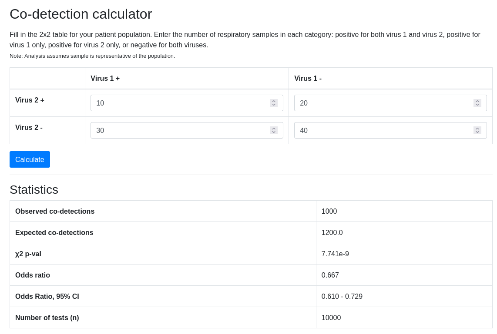

# codetectcalc
Co-detection calculator

[Interference between rhinovirus and influenza A virus: a clinical data analysis and experimental infection study](https://www.thelancet.com/journals/lanmic/article/PIIS2666-5247(20)30114-2/fulltext)

## Note
Originally, the website had a data sharing feature, but the feature was removed to switch to static hosting through GitHub

## License
[GPL-2.0-or-later](https://spdx.org/licenses/GPL-2.0-or-later.html)